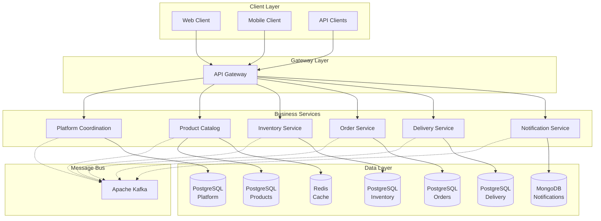

# Microservices Design

## Overview

This document details the microservices architecture for the First Viscount e-commerce platform, including service boundaries, communication patterns, and design decisions.

## Service Architecture

### Core Business Services



## Service Specifications

### 1. Platform Coordination Service

**Purpose**: Orchestrate complex business workflows and manage distributed transactions

**Key Responsibilities**:
- Saga orchestration for order fulfillment
- Workflow state management
- Compensation logic for failures
- Service health monitoring
- Business process coordination

**Technology Stack**:
```yaml
framework: Spring Boot 3.2
orchestration: Temporal or Axon Framework
database: PostgreSQL
messaging: Apache Kafka
```

**API Endpoints**:
```
POST   /api/v1/workflows/order/start
GET    /api/v1/workflows/{workflowId}/status
POST   /api/v1/workflows/{workflowId}/cancel
GET    /api/v1/workflows/health
```

### 2. Product Catalog Service

**Purpose**: Manage product information, categories, and pricing

**Key Responsibilities**:
- Product CRUD operations
- Category management
- Price management and history
- Product search and filtering
- Inventory availability integration

**Technology Stack**:
```yaml
framework: Spring Boot 3.2
database: PostgreSQL
cache: Redis
search: PostgreSQL Full-Text Search (Elasticsearch future)
```

**API Endpoints**:
```
GET    /api/v1/products
GET    /api/v1/products/{productId}
POST   /api/v1/products
PUT    /api/v1/products/{productId}
DELETE /api/v1/products/{productId}
GET    /api/v1/products/search?q={query}
GET    /api/v1/categories
POST   /api/v1/categories
```

### 3. Inventory Service

**Purpose**: Track inventory levels and manage stock reservations

**Key Responsibilities**:
- Real-time inventory tracking
- Stock reservation management
- Inventory replenishment
- Low-stock alerts
- Reservation timeout handling

**Technology Stack**:
```yaml
framework: Spring Boot 3.2
database: PostgreSQL with row-level locking
messaging: Apache Kafka
patterns: Optimistic locking, Event sourcing
```

**API Endpoints**:
```
GET    /api/v1/inventory/{productId}
POST   /api/v1/inventory/check-availability
POST   /api/v1/inventory/reserve
POST   /api/v1/inventory/release
PUT    /api/v1/inventory/replenish
GET    /api/v1/inventory/low-stock
```

### 4. Order Management Service

**Purpose**: Handle complete order lifecycle from creation to completion

**Key Responsibilities**:
- Order creation and validation
- Payment processing integration
- Order state management
- Order history and tracking
- Refund and cancellation handling

**Technology Stack**:
```yaml
framework: Spring Boot 3.2
database: PostgreSQL
state-machine: Spring State Machine
payment: Payment gateway SDKs
messaging: Apache Kafka
```

**API Endpoints**:
```
POST   /api/v1/orders
GET    /api/v1/orders/{orderId}
GET    /api/v1/orders/customer/{customerId}
PUT    /api/v1/orders/{orderId}/status
POST   /api/v1/orders/{orderId}/cancel
POST   /api/v1/orders/{orderId}/refund
GET    /api/v1/orders/search
```

### 5. Delivery Management Service

**Purpose**: Manage shipping, tracking, and delivery processes

**Key Responsibilities**:
- Shipping label generation
- Carrier integration (FedEx, UPS, USPS)
- Real-time tracking updates
- Delivery confirmation
- Returns management

**Technology Stack**:
```yaml
framework: Spring Boot 3.2
database: PostgreSQL
integrations: Carrier APIs
messaging: Apache Kafka
```

**API Endpoints**:
```
POST   /api/v1/deliveries
GET    /api/v1/deliveries/{deliveryId}
PUT    /api/v1/deliveries/{deliveryId}/status
GET    /api/v1/deliveries/track/{trackingNumber}
POST   /api/v1/deliveries/{deliveryId}/confirm
POST   /api/v1/deliveries/returns
```

### 6. Notification Service

**Purpose**: Handle all customer communications across multiple channels

**Key Responsibilities**:
- Email notifications
- SMS notifications
- Template management
- Notification preferences
- Delivery tracking and retry

**Technology Stack**:
```yaml
framework: Spring Boot 3.2
database: MongoDB
email: SendGrid or AWS SES
sms: Twilio
messaging: Apache Kafka
```

**API Endpoints**:
```
POST   /api/v1/notifications/send
GET    /api/v1/notifications/templates
POST   /api/v1/notifications/templates
PUT    /api/v1/notifications/preferences/{customerId}
GET    /api/v1/notifications/history/{customerId}
```

## Communication Patterns

### Synchronous Communication (REST)

Used for:
- Client-to-service communication
- Real-time queries
- CRUD operations
- Immediate response requirements

```java
@RestController
@RequestMapping("/api/v1/products")
public class ProductController {
    
    @GetMapping("/{id}")
    public ResponseEntity<ProductDTO> getProduct(@PathVariable Long id) {
        return ResponseEntity.ok(productService.findById(id));
    }
}
```

### Asynchronous Communication (Kafka)

Used for:
- Service-to-service events
- Long-running processes
- Event sourcing
- System decoupling

```java
@Component
public class OrderEventPublisher {
    
    @Autowired
    private KafkaTemplate<String, OrderEvent> kafkaTemplate;
    
    public void publishOrderCreated(Order order) {
        OrderCreatedEvent event = OrderCreatedEvent.builder()
            .orderId(order.getId())
            .customerId(order.getCustomerId())
            .items(order.getItems())
            .timestamp(Instant.now())
            .build();
            
        kafkaTemplate.send("order-events", order.getId(), event);
    }
}
```

## Event-Driven Patterns

### Event Types

1. **Commands** - Request to perform an action
   - CreateOrderCommand
   - ReserveInventoryCommand
   - ProcessPaymentCommand

2. **Events** - Something that has happened
   - OrderCreatedEvent
   - InventoryReservedEvent
   - PaymentProcessedEvent

3. **Queries** - Request for information
   - GetOrderStatusQuery
   - CheckInventoryQuery

### Event Flow Example: Order Processing

```
1. Client → Order Service: POST /orders
2. Order Service → Kafka: OrderCreatedEvent
3. Platform Coordination → Saga Start
4. Coordination → Inventory: ReserveInventoryCommand
5. Inventory → Kafka: InventoryReservedEvent
6. Coordination → Payment: ProcessPaymentCommand
7. Payment → Kafka: PaymentProcessedEvent
8. Coordination → Delivery: ScheduleDeliveryCommand
9. Delivery → Kafka: DeliveryScheduledEvent
10. Coordination → Notification: SendOrderConfirmationCommand
11. Notification → Kafka: NotificationSentEvent
12. Coordination → Order Service: UpdateOrderStatusCommand
```

## Data Management Patterns

### Database per Service

Each service owns its data:
- No shared database access
- Data consistency through events
- Service autonomy maintained

### Event Sourcing (Selective)

Applied to:
- Order Service (order history)
- Inventory Service (stock movements)
- Platform Coordination (workflow state)

Benefits:
- Complete audit trail
- Time-travel debugging
- Event replay capability

### CQRS (Where Beneficial)

Implemented in:
- Product Catalog (read-heavy)
- Order History (complex queries)

```java
// Command Model
@Entity
public class Product {
    @Id
    private Long id;
    private String name;
    private BigDecimal price;
    // ... write operations
}

// Query Model
@Document
public class ProductView {
    private String id;
    private String name;
    private BigDecimal price;
    private Integer availableStock;
    private List<String> categories;
    // ... optimized for queries
}
```

## Resilience Patterns

### Circuit Breaker

```java
@Component
public class PaymentServiceClient {
    
    @CircuitBreaker(name = "payment-service", fallbackMethod = "paymentFallback")
    public PaymentResult processPayment(PaymentRequest request) {
        return paymentApi.process(request);
    }
    
    public PaymentResult paymentFallback(PaymentRequest request, Exception ex) {
        return PaymentResult.builder()
            .status(PaymentStatus.PENDING)
            .message("Payment service temporarily unavailable")
            .build();
    }
}
```

### Retry with Backoff

```java
@Retryable(
    value = {ServiceUnavailableException.class},
    maxAttempts = 3,
    backoff = @Backoff(delay = 1000, multiplier = 2)
)
public void sendNotification(NotificationRequest request) {
    notificationApi.send(request);
}
```

### Bulkhead Pattern

```java
@Component
public class OrderProcessingService {
    
    private final ThreadPoolTaskExecutor orderExecutor;
    private final ThreadPoolTaskExecutor paymentExecutor;
    
    public OrderProcessingService() {
        this.orderExecutor = createExecutor("order-pool", 10);
        this.paymentExecutor = createExecutor("payment-pool", 5);
    }
    
    private ThreadPoolTaskExecutor createExecutor(String name, int poolSize) {
        ThreadPoolTaskExecutor executor = new ThreadPoolTaskExecutor();
        executor.setCorePoolSize(poolSize);
        executor.setMaxPoolSize(poolSize);
        executor.setThreadNamePrefix(name);
        executor.initialize();
        return executor;
    }
}
```

## Service Discovery

### Options Evaluated

1. **Spring Cloud Netflix Eureka** - Traditional choice
2. **Kubernetes Service Discovery** - Cloud-native
3. **Consul** - Multi-datacenter support

### Recommendation: Kubernetes Native

For production deployment:
```yaml
apiVersion: v1
kind: Service
metadata:
  name: order-service
spec:
  selector:
    app: order-service
  ports:
    - port: 8080
      targetPort: 8080
```

For local development:
```yaml
# docker-compose.yml
services:
  order-service:
    container_name: order-service
    networks:
      - platform-network
    environment:
      - INVENTORY_SERVICE_URL=http://inventory-service:8080
```

## API Gateway Pattern

### Responsibilities

1. **Request Routing**
```yaml
spring:
  cloud:
    gateway:
      routes:
        - id: product-service
          uri: lb://PRODUCT-SERVICE
          predicates:
            - Path=/api/v1/products/**
```

2. **Authentication**
```java
@Component
public class AuthenticationFilter extends AbstractGatewayFilterFactory<Config> {
    
    @Override
    public GatewayFilter apply(Config config) {
        return (exchange, chain) -> {
            String token = extractToken(exchange.getRequest());
            
            if (!isValidToken(token)) {
                exchange.getResponse().setStatusCode(HttpStatus.UNAUTHORIZED);
                return exchange.getResponse().setComplete();
            }
            
            return chain.filter(exchange);
        };
    }
}
```

3. **Rate Limiting**
```java
@Component
public class RateLimitFilter implements GlobalFilter {
    
    private final RateLimiter rateLimiter = RateLimiter.create(1000.0); // 1000 req/sec
    
    @Override
    public Mono<Void> filter(ServerWebExchange exchange, GatewayFilterChain chain) {
        if (!rateLimiter.tryAcquire()) {
            exchange.getResponse().setStatusCode(HttpStatus.TOO_MANY_REQUESTS);
            return exchange.getResponse().setComplete();
        }
        return chain.filter(exchange);
    }
}
```

## Testing Strategy

### Unit Testing
- Service logic testing
- Mocked dependencies
- Fast execution

### Integration Testing
- API endpoint testing
- Database integration
- Message broker integration

### Contract Testing
- Consumer-driven contracts
- Spring Cloud Contract
- Pact for cross-service contracts

### End-to-End Testing
- Complete workflow testing
- Production-like environment
- Performance validation

## Performance Considerations

### Caching Strategy
- Redis for frequently accessed data
- Cache-aside pattern
- TTL-based expiration

### Database Optimization
- Connection pooling
- Query optimization
- Index management
- Read replicas (future)

### Async Processing
- Non-blocking I/O
- Reactive programming where beneficial
- Event-driven architecture

## Security Considerations

### Service-to-Service
- mTLS in production
- Service accounts
- Limited permissions

### API Security
- OAuth2/JWT tokens
- Rate limiting
- Input validation
- SQL injection prevention

## Monitoring & Observability

### Metrics (Micrometer + Prometheus)
```java
@RestController
public class OrderController {
    
    private final MeterRegistry meterRegistry;
    
    @PostMapping("/orders")
    @Timed(value = "order.creation.time", description = "Time taken to create order")
    public ResponseEntity<Order> createOrder(@RequestBody OrderRequest request) {
        meterRegistry.counter("order.created", "type", request.getType()).increment();
        return ResponseEntity.ok(orderService.create(request));
    }
}
```

### Distributed Tracing (Spring Cloud Sleuth + Jaeger)
```yaml
spring:
  sleuth:
    sampler:
      probability: 1.0
  zipkin:
    base-url: http://jaeger:9411
```

### Logging (Structured JSON)
```java
@Slf4j
@Component
public class OrderService {
    
    public Order createOrder(OrderRequest request) {
        log.info("Creating order", Map.of(
            "customerId", request.getCustomerId(),
            "itemCount", request.getItems().size(),
            "totalAmount", request.getTotalAmount()
        ));
        // ... business logic
    }
}
```

## Development Best Practices

### API Design
- RESTful principles
- Consistent naming
- Versioning strategy
- OpenAPI documentation

### Code Organization
```
service-name/
├── src/main/java/
│   ├── controller/
│   ├── service/
│   ├── repository/
│   ├── model/
│   ├── dto/
│   ├── event/
│   ├── config/
│   └── exception/
├── src/main/resources/
│   ├── application.yml
│   ├── application-dev.yml
│   └── db/migration/
└── src/test/
```

### Environment Configuration
- Externalized configuration
- Environment-specific profiles
- Secrets management
- Feature flags

## References

- [Service Specifications](./service-specifications/)
- [Messaging Architecture](./messaging-architecture.md)
- [API Design Patterns](../02-implementation/api-design-patterns.md)
- [Testing Strategy](../03-testing/)