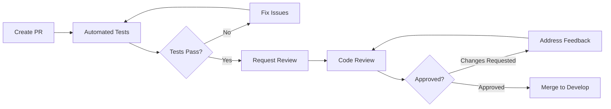

# Development Workflow

This document outlines the development workflow for the First Viscount platform, including Git flow, pull request process, code reviews, and team collaboration practices.

## Git Flow Strategy

We use a modified Git Flow strategy optimized for continuous delivery:

```
main ─────────────────────────────────────────────► Production
  │                                                    
  └─► develop ────────────────────────────────────► Integration
       │     │                                         
       │     └─► feature/JIRA-123-add-search ────► Feature Work
       │                                               
       └─────────► release/1.2.0 ────────────────► Release Prep
                                                      
       hotfix/JIRA-456-fix-payment ──────────────► Emergency Fix
```

### Branch Types and Purposes

| Branch Type | Naming Convention | Purpose | Base Branch | Merge Target |
|------------|------------------|---------|-------------|--------------|
| main | `main` | Production code | - | - |
| develop | `develop` | Integration branch | main | main |
| feature | `feature/JIRA-XXX-description` | New features | develop | develop |
| bugfix | `bugfix/JIRA-XXX-description` | Bug fixes | develop | develop |
| release | `release/X.Y.Z` | Release preparation | develop | main & develop |
| hotfix | `hotfix/JIRA-XXX-description` | Emergency fixes | main | main & develop |

## Development Process

### 1. Starting New Work

```bash
# 1. Update your local develop branch
git checkout develop
git pull origin develop

# 2. Create feature branch
git checkout -b feature/JIRA-123-add-product-search

# 3. Make your changes
# ... code changes ...

# 4. Commit with conventional commits
git add .
git commit -m "feat(product): add elasticsearch product search

- Implement full-text search for products
- Add search API endpoints
- Include filtering and pagination

JIRA-123"
```

### 2. Commit Message Convention

We follow [Conventional Commits](https://www.conventionalcommits.org/):

```
<type>(<scope>): <subject>

<body>

<footer>
```

**Types:**
- `feat`: New feature
- `fix`: Bug fix
- `docs`: Documentation changes
- `style`: Code style changes (formatting, semicolons, etc)
- `refactor`: Code refactoring
- `test`: Adding or modifying tests
- `chore`: Maintenance tasks
- `perf`: Performance improvements
- `ci`: CI/CD changes
- `build`: Build system changes
- `revert`: Reverting changes

**Examples:**
```bash
# Feature
git commit -m "feat(order): add order cancellation workflow

- Implement cancellation API endpoint
- Add cancellation event publishing
- Update order state machine

JIRA-234"

# Bug fix
git commit -m "fix(inventory): correct stock calculation for bundles

- Fix recursive calculation for product bundles
- Add validation for circular dependencies

JIRA-345"

# Documentation
git commit -m "docs(api): update order API documentation

- Add cancellation endpoint docs
- Update response examples

JIRA-456"
```

### 3. Pull Request Process

#### Creating a Pull Request

1. **Push your branch**
   ```bash
   git push -u origin feature/JIRA-123-add-product-search
   ```

2. **Create PR via GitHub CLI**
   ```bash
   gh pr create \
     --title "feat(product): Add elasticsearch product search" \
     --body "$(cat .github/pull_request_template.md)" \
     --base develop \
     --assignee @me \
     --label "feature,needs-review"
   ```

3. **PR Title Format**
   ```
   <type>(<scope>): <description> [JIRA-XXX]
   ```

#### Pull Request Template

```markdown
## Description
Brief description of changes made and why.

## Type of Change
- [ ] Bug fix (non-breaking change which fixes an issue)
- [ ] New feature (non-breaking change which adds functionality)
- [ ] Breaking change (fix or feature that would cause existing functionality to not work as expected)
- [ ] Documentation update

## Testing
- [ ] Unit tests pass locally
- [ ] Integration tests pass locally
- [ ] Manual testing completed
- [ ] Performance impact assessed

## Checklist
- [ ] My code follows the project's style guidelines
- [ ] I have performed a self-review of my own code
- [ ] I have commented my code, particularly in hard-to-understand areas
- [ ] I have made corresponding changes to the documentation
- [ ] My changes generate no new warnings
- [ ] I have added tests that prove my fix is effective or that my feature works
- [ ] New and existing unit tests pass locally with my changes
- [ ] Any dependent changes have been merged and published

## Related Issues
- JIRA-123
- Closes #456

## Screenshots (if applicable)
Add screenshots for UI changes

## Additional Notes
Any additional information that reviewers should know
```

### 4. Code Review Process

#### Review Guidelines

**For Reviewers:**

1. **Response Time**: Review within 24 hours of assignment
2. **Focus Areas**:
   - Business logic correctness
   - Code quality and maintainability
   - Performance implications
   - Security concerns
   - Test coverage

3. **Review Checklist**:
   ```markdown
   - [ ] Code follows project conventions
   - [ ] No obvious bugs or logic errors
   - [ ] Adequate test coverage
   - [ ] No security vulnerabilities
   - [ ] Documentation updated
   - [ ] No performance regressions
   - [ ] Dependencies justified
   ```

4. **Feedback Format**:
   ```markdown
   # Required Changes 🔴
   - Critical issues that must be fixed
   
   # Suggestions 🟡
   - Improvements that should be considered
   
   # Nitpicks 🟢
   - Minor style or preference issues
   
   # Praise 💚
   - Highlight good practices
   ```

**For Authors:**

1. **Self-Review First**: Review your own PR before requesting reviews
2. **Keep PRs Small**: Aim for < 400 lines of code changes
3. **Respond Promptly**: Address feedback within 24 hours
4. **Update Status**: Mark conversations as resolved when addressed

#### Review Workflow



### 5. Continuous Integration

#### Pre-merge Checks

All PRs must pass these automated checks:

1. **Build Verification**
   ```yaml
   - Maven/Gradle build success
   - Docker image builds successfully
   ```

2. **Test Suite**
   ```yaml
   - Unit tests: 100% pass rate
   - Integration tests: 100% pass rate
   - Code coverage: ≥ 80%
   ```

3. **Code Quality**
   ```yaml
   - SonarQube quality gate: Passed
   - SpotBugs: No high-priority issues
   - Checkstyle: No violations
   ```

4. **Security Scanning**
   ```yaml
   - Dependency check: No critical vulnerabilities
   - SAST scan: No high-risk findings
   ```

#### CI Configuration Example

```yaml
# .github/workflows/pr-checks.yml
name: PR Checks

on:
  pull_request:
    types: [opened, synchronize, reopened]

jobs:
  build-and-test:
    runs-on: ubuntu-latest
    steps:
      - uses: actions/checkout@v3
      
      - name: Set up JDK 21
        uses: actions/setup-java@v3
        with:
          java-version: '21'
          distribution: 'temurin'
      
      - name: Cache Maven dependencies
        uses: actions/cache@v3
        with:
          path: ~/.m2
          key: ${{ runner.os }}-m2-${{ hashFiles('**/pom.xml') }}
      
      - name: Build with Maven
        run: mvn clean compile
      
      - name: Run tests
        run: mvn test
      
      - name: Generate coverage report
        run: mvn jacoco:report
      
      - name: SonarQube scan
        env:
          GITHUB_TOKEN: ${{ secrets.GITHUB_TOKEN }}
          SONAR_TOKEN: ${{ secrets.SONAR_TOKEN }}
        run: mvn sonar:sonar
      
      - name: Upload coverage to Codecov
        uses: codecov/codecov-action@v3
```

### 6. Merging Strategy

#### Feature → Develop

```bash
# Ensure branch is up to date
git checkout feature/JIRA-123-add-product-search
git pull origin develop
git rebase develop

# If conflicts, resolve and continue
git add .
git rebase --continue

# Push updated branch
git push --force-with-lease origin feature/JIRA-123-add-product-search

# Merge via GitHub (squash and merge preferred)
```

#### Develop → Main (Release)

```bash
# Create release branch
git checkout -b release/1.2.0 develop

# Update version numbers
mvn versions:set -DnewVersion=1.2.0
git commit -am "chore: bump version to 1.2.0"

# After testing and approval
git checkout main
git merge --no-ff release/1.2.0
git tag -a v1.2.0 -m "Release version 1.2.0"
git push origin main --tags

# Merge back to develop
git checkout develop
git merge --no-ff release/1.2.0
```

## Team Collaboration

### Daily Practices

1. **Daily Standup Format**
   ```
   - What I completed yesterday
   - What I'm working on today
   - Any blockers
   - PRs needing review
   ```

2. **PR Review Rotation**
   - Each team member reviews 2-3 PRs daily
   - Use @mention for urgent reviews
   - Rotate "review champion" weekly

3. **Pair Programming**
   - Complex features
   - Bug investigations
   - Knowledge sharing
   - Use VS Code Live Share or similar

### Communication Channels

| Channel | Purpose | Response Time |
|---------|---------|---------------|
| Slack #dev-general | General development discussion | 2-4 hours |
| Slack #pr-reviews | PR notifications and reviews | 1-2 hours |
| Slack #incidents | Production issues | Immediate |
| GitHub Issues | Bug reports, feature requests | 24 hours |
| Confluence | Documentation, decisions | N/A |

### Work Planning

#### Sprint Planning

```markdown
## Sprint Planning Template

### Sprint Goal
Main objective for this sprint

### Capacity
- Developer 1: 6 days (2 days PTO)
- Developer 2: 8 days
- Total: 14 developer days

### Commitments
| JIRA | Story | Points | Assignee |
|------|-------|--------|----------|
| JIRA-123 | Add product search | 5 | @dev1 |
| JIRA-124 | Fix inventory sync | 3 | @dev2 |

### Risks
- Dependency on external team for API
- New Elasticsearch cluster stability
```

#### Definition of Done

A story/task is considered done when:

- [ ] Code complete and pushed to repository
- [ ] Unit tests written and passing (coverage ≥ 80%)
- [ ] Integration tests written and passing
- [ ] Code reviewed and approved by 2 team members
- [ ] Documentation updated (API, README, etc.)
- [ ] Deployed to development environment
- [ ] Acceptance criteria verified
- [ ] No critical SonarQube issues
- [ ] Performance impact assessed
- [ ] Security review completed (if applicable)

## Development Environment

### Local Setup Automation

```bash
#!/bin/bash
# scripts/dev-setup.sh

echo "🚀 Setting up development environment..."

# 1. Check prerequisites
command -v java >/dev/null 2>&1 || { echo "Java 21 required"; exit 1; }
command -v mvn >/dev/null 2>&1 || { echo "Maven required"; exit 1; }
command -v docker >/dev/null 2>&1 || { echo "Docker required"; exit 1; }

# 2. Clone repositories
gh repo list firstviscount --limit 100 | \
  grep -E "-service$" | \
  xargs -L1 gh repo clone

# 3. Install git hooks
for repo in *-service; do
  cd $repo
  cp ../.github/hooks/* .git/hooks/
  chmod +x .git/hooks/*
  cd ..
done

# 4. Setup IDE
echo "📝 Importing IDE settings..."
cp .idea/codeStyles.xml ~/.config/JetBrains/IntelliJIdea*/

echo "✅ Development environment ready!"
```

### Git Hooks

#### Pre-commit Hook
```bash
#!/bin/bash
# .git/hooks/pre-commit

# Run tests
mvn test

# Check code style
mvn checkstyle:check

# Verify no secrets
git secrets --pre_commit_hook -- "$@"
```

#### Commit Message Hook
```bash
#!/bin/bash
# .git/hooks/commit-msg

# Validate commit message format
commit_regex='^(feat|fix|docs|style|refactor|test|chore|perf|ci|build|revert)(\(.+\))?: .{1,50}'
if ! grep -qE "$commit_regex" "$1"; then
    echo "Invalid commit message format!"
    echo "Format: <type>(<scope>): <subject>"
    exit 1
fi
```

## Troubleshooting

### Common Issues

1. **Merge Conflicts**
   ```bash
   # Rebase instead of merge
   git pull --rebase origin develop
   
   # If conflicts occur
   git status  # See conflicted files
   # Fix conflicts in editor
   git add <resolved-files>
   git rebase --continue
   ```

2. **Failed CI Builds**
   ```bash
   # Run CI locally first
   act -j build-and-test  # Using GitHub act tool
   
   # Or manually
   mvn clean verify
   ```

3. **Large PRs**
   ```bash
   # Split into multiple PRs
   git checkout -b feature/JIRA-123-part-1
   # Cherry-pick specific commits
   git cherry-pick <commit-hash>
   ```

## Best Practices

1. **Keep PRs Small and Focused**
   - Single responsibility
   - Easier to review
   - Faster to merge

2. **Write Meaningful Commit Messages**
   - Future you will thank you
   - Helps with debugging
   - Documents decision reasoning

3. **Test Before Pushing**
   - Run tests locally
   - Check for compilation errors
   - Verify no secrets committed

4. **Communicate Proactively**
   - Update JIRA tickets
   - Comment on PRs
   - Ask for help early

5. **Maintain Clean Git History**
   - Squash commits when merging
   - Use interactive rebase for cleanup
   - Avoid merge commits in feature branches

---
*Last Updated: January 2025*